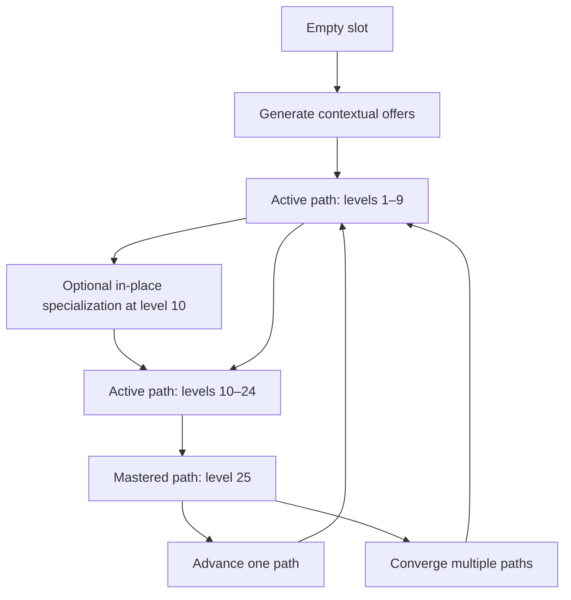

# Progression System Reference

**Status:** Canonical implementation specification

**Applies to:** Classes, professions, skills, advancement offers, specializations, convergences, and progression-altering states

**Last updated:** 2026-08-02

## 1. Purpose

This document defines the finalized character-progression architecture for the game.

The game does **not** use one fixed class tree in which a character chooses a single branch and permanently abandons every alternative. It uses a contextual, slot-based progression system:

> Characters place classes into limited class slots, allocate shared XP to those slots, and develop each path from level 1 through level 25. At level 10, a path may add an in-place specialization without changing its level, XP, slot, base identity, or instance. At level 25, a mastered path may advance alone or converge with other eligible level-25 paths into a new level-1 path while retaining permanent rewards and lineage.

Professions use a parallel set of profession slots. Classes and professions can influence one another indirectly through shared skills, knowledge, behavior, and experience, but normal class lines cannot require a profession and normal profession lines cannot require a class.

The existing `Class Tree Inventory.md` remains useful as a catalog of class concepts, names, and possible relationships. Its old fixed-tree advancement rules are superseded by this document.

## 2. Canonical Decisions

The following decisions are authoritative:

1. **Classes are slotted progression paths.**
2. **Professions are slotted progression paths in a separate domain.**
3. **The character has one shared, unallocated XP pool.**
4. **The player chooses which eligible class slot receives shared XP.** Shared XP may also pay authored progression-unlock costs.
5. **Every active class and profession has its own level and XP progress.**
6. **The standard maximum level for an individual class or profession instance is 10.**
7. **Reaching level 10 does not end or replace a path.** It makes contextual specialization layers eligible while normal leveling continues.
8. **A specialization is additive.** It preserves the path's level, XP, slot, base identity, instance ID, and lineage.
9. **At level 25, advancement creates a new level-1 path.** It may consume one mastered path or converge two or more eligible mastered paths.
10. **A convergence occupies one of its source slots and empties the other consumed slots.**
11. **All permanent statistics and learned skills granted by incorporated paths remain on the character.**
12. **The resulting path receives lineage records for every path consumed to create it.**
13. **Class and profession offers are generated contextually rather than selected from a universal list.**
14. **Offers can depend on affinities, attributes, skills, behavior, equipment, environment, race, teachers, affiliations, divine relationships, transformations, discoveries, and existing progression.**
15. **A class name can have multiple valid unlock routes.**
16. **Requirements should normally test capabilities and evidence, not the source that produced them.**
17. **Primary class lines cannot hard-require a profession identity.**
18. **Primary profession lines cannot hard-require a class identity.**
19. **Rare cross-system paths may explicitly combine class and profession concepts, but they must be identified as cross-system paths rather than hidden inside a normal class or profession line.**
20. **Skills, titles, affiliations, divine bonds, conditions, and transformations are not classes.**
21. **Transformations may modify offers, close paths, or force advancement without occupying an ordinary class slot.**
22. **Repeated class ingredients are supported.** A recipe may require two separately developed instances from the same class or family.
23. **Class rarity and class level are separate concepts.** Rarity describes the depth or significance of a class; level describes progress from 1 through 25 within the current class.
24. **The former global advancement thresholds of levels 10, 25, 50, and 75 are retired.** Level 10 and level 25 are now local milestones on each independent path: specialization eligibility and mastery/advancement eligibility respectively.
25. **Classes are always the primary progression tree.** Professions are always the secondary progression subtree, regardless of their levels.
26. **Overall character level is the sum of the levels of all currently active class instances.** Profession levels do not contribute.
27. **Consumed class levels no longer count toward overall character level.** Specialization and convergence therefore intentionally reduce overall level while preserving earned permanent rewards.
28. **Profession levels do not receive allocated shared XP.** Relevant actions apply XP directly to an active profession instance and its associated skills.
29. **An ordinary action does not require its related profession.** Anyone can mine baseline ore, for example, but only a character with the active Miner profession gains Miner and Mining skill XP from mining.
30. **Class levels grant a configurable attribute budget split evenly between authored automatic allocation and free player allocation.** Profession levels grant authored fixed rewards and little or no free allocation.
31. **Healer and Alchemist are classes. Apothecary is a profession.** As a general rule, a role useful to a dungeon party or combat encounter is a class, including support roles.
32. **Character creation does not directly select a class.** The player selects a race and either a starter equipment kit or a constrained custom loadout.
33. **A newly created character begins classless at overall level 0.** Their unlocked class slots are empty until they accept a contextual foundation offer.
34. **Starter kits are item bundles, not hidden class assignments.** The same class may be revealed by equipment, attributes, practice, teachers, or other valid routes.
35. **Initial offers evaluate the resulting character facts.** A sword may support Warrior and a bow may support Archer, but changing or removing the evidence requires the offer to be revalidated before acceptance.

## 3. Progression Domains

| Domain | Purpose | Uses slots | Has levels | Can combine within domain |
|---|---|---:|---:|---:|
| Class | Combat, magic, adventuring methods, and integrated combat identities | Yes | Yes | Yes |
| Profession | Crafting, gathering, trade, production, scholarship, and economic identities | Yes | Yes | Yes |
| Skill | A specific learned competency | No | Skill-specific | No |
| Affinity | Natural or acquired compatibility with an element, method, creature, or concept | No | Usually a value or rank | No |
| Knowledge | Facts and practical understanding acquired from any source | No | Usually a value, rank, or tag | No |
| Title | Recognition of deeds, status, or reputation | No | No | No |
| Affiliation | Membership, office, rank, or social authority | No | Organization-specific | No |
| Divine bond | Relationship with a deity or divine source | No | Relationship-specific | No |
| Condition | Temporary or persistent state affecting the character | No | State-specific | No |
| Transformation | A change to what the character fundamentally is | No | Transformation-specific | No |

These domains interact through the offer engine, but they are not interchangeable.

For example:

- Swordsmanship skill can help unlock Swordsman.
- Mining knowledge can help satisfy Geomancer's geological-understanding route.
- The Miner profession is not required for Geomancer.
- The Geomancer class is not sufficient by itself to make a character a Miner.
- Void-Touched changes class offers but is a transformation state, not a class slot.
- Knight of Westvale may grant authority and reputation but is an affiliation or title, not necessarily the Knight class.

## 4. Classes

### 4.1 What a class represents

A class is an active progression container that:

- occupies one class slot;
- receives allocated shared XP;
- advances from level 1 through level 25;
- grants permanent statistics;
- teaches skills or upgrades existing skills;
- may grant active-class features;
- records how the character practiced the class;
- contributes to future offer requirements;
- can add an in-place specialization at level 10;
- can advance alone or participate in a convergence at level 25.

A class is more than a label. It has progression content that the player actively develops.

### 4.2 Starting class families

The six established foundation families remain:

- Warrior
- Archer
- Rogue
- Priest
- Mage Apprentice
- Wanderer

These are the major starting families, not a universal menu that must always show all six options.

The offer engine determines which foundations are available to a character based on their creation choices, race, affinities, background, starting skills, environment, teachers, equipment, and other applicable facts.

Foundation classes should have broad routes so that a normal character is never left without reasonable starting choices.

### 4.3 Class slots

Each character has a limited collection of class slots.

A class slot can be:

- **Empty:** ready to receive a new class.
- **Active:** contains a class below level 25, including a specialized class from levels 10 through 24.
- **Mastered:** contains a level-25 class that can remain active or be used in an advancement.
- **Locked:** exists but is not yet available to the character.

The exact number of starting slots and the rules for earning additional slots are balance configuration, not hard-coded progression rules.

### 4.4 Overall character level

Overall character level is derived rather than independently advanced:

```text
Overall Level = sum of levels in currently occupied class slots
```

Profession levels never contribute to this value. In-place specialization does not change the active class or its contribution. A class consumed by level-25 advancement or convergence stops contributing because it is no longer active. For example, Warrior 25 plus Mage Apprentice 25 produces a level-1 Spellsword and changes overall level from 50 to 1. This reduction is intentional. Permanent attributes, skills, knowledge, and other retained rewards from both source classes remain on the character.

### 4.5 Class attribute rewards

Each class level grants an authored attribute-point budget. The default budget is split evenly:

- half is assigned automatically according to that class's configured attribute weights;
- half becomes free attribute points that the player may assign;
- odd budgets define their rounding behavior in configuration;
- automatic and free grants are both permanent and recorded in the reward ledger.

### 4.6 Duplicate classes and family weighting

The system supports repeated ingredients such as:

- Warrior + Warrior + Mage Apprentice
- Wanderer + Wanderer + Priest
- Warrior + Mage Apprentice + Mage Apprentice

This requires separately developed class instances. Duplicate instances:

- occupy separate slots;
- maintain separate XP and levels;
- can each contribute to a convergence recipe;
- do not teach the same unique skill twice;
- may repeat numerical rewards only where the reward explicitly permits stacking.

Repeated ingredients represent emphasis. `Warrior ×2 + Mage Apprentice` should produce a more martial result than `Warrior + Mage Apprentice ×2`, even though both involve the same two class families.

## 5. Professions

### 5.1 What a profession represents

A profession is a slotted, levelable path for productive, economic, technical, or scholarly work.

Examples include:

- Miner
- Smith
- Builder
- Merchant
- Apothecary
- Scholar
- Farmer
- Cook
- Engineer

A profession:

- occupies a profession slot;
- receives XP directly from relevant profession actions;
- advances from level 1 through level 25;
- grants profession-related statistics, techniques, recipes, knowledge, and efficiencies;
- can specialize or combine with other professions;
- never consumes a class slot.

Profession levels grant authored fixed rewards rather than the class attribute budget. A Miner level might grant `+1 Strength`, for example. Free attribute points from profession levels should be exceptional and explicitly authored.

Healer and Alchemist are classes because they provide capabilities useful in a dungeon party or combat. Apothecary is the corresponding medicine-producing profession.

### 5.2 Profession advancement

Professions follow the same structural advancement rules as classes:

```text
Miner 10 + Prospector specialization
Smith 10 + Weaponsmith specialization
Miner 25 + Smith 25 → Metallurgist 1
```

Specialization keeps the original profession instance in place. Level-25 profession advancement or convergence consumes the mastered source instances but retains everything permanently learned from them.

### 5.3 Profession offer sources

A profession may be offered through different routes.

Miner, for example, could be offered through:

- extracting ore and stone;
- being trained by a miner or mining guild;
- operating or managing a mine;
- acquiring practical tunnel-safety knowledge;
- using Earth magic for excavation while also learning practical extraction;
- racial or cultural underground knowledge combined with actual practice.

Earth magic can accelerate or alter the route, but moving stone magically does not automatically teach ore grading, structural bracing, claim management, ventilation, or efficient extraction.

## 6. XP Allocation

### 6.1 Shared unallocated XP

The character maintains one general pool:

- `UnallocatedXp`

Adventure, combat, magical, social, exploration, quest, and other authored rewards add XP to this shared pool. The pool is not itself a character level and does not automatically advance a path.

Shared XP can be:

- allocated to an eligible occupied class slot;
- spent on authored class or profession unlock costs;
- reserved by the player for a later path or unlock.

Shared XP cannot be allocated to a profession instance to raise its level.

### 6.2 Allocating shared XP to a class

When the player allocates XP:

1. The player selects an eligible occupied class slot.
2. The system transfers no more than the requested amount from `UnallocatedXp` to that class instance.
3. The class levels when its configured threshold is reached.
4. Level rewards are granted atomically.
5. Excess XP remains on that instance unless it reaches level 25.
6. XP beyond the level-25 cap returns to or remains in `UnallocatedXp`.

XP must never silently disappear because a class reaches its maximum level.

### 6.3 Direct profession and skill XP

Profession advancement is practice-driven. When a character performs a profession-relevant action:

1. The action succeeds or fails according to the ordinary activity rules; the profession is not required for baseline access unless the activity itself explicitly says otherwise.
2. If the relevant profession is active, authored XP is applied directly to that profession instance.
3. Authored XP is also applied directly to the associated skill or skills granted by that profession.
4. Profession and skill level rewards are granted atomically.
5. No XP from the action enters `UnallocatedXp` and no other class or profession receives it.

For example, any character may mine baseline ore. A character with Miner gains Miner XP and Mining skill XP from the same action. Higher Mining skill can improve ore yield and gem-drop chance. A character without Miner receives the baseline ore but no Miner or Mining progression from that action.

### 6.4 Filling an empty slot

An empty slot does not accept XP until it contains a path.

When the player chooses to fill an empty slot:

1. The system captures a progression-context snapshot.
2. The offer engine evaluates eligible definitions for that domain.
3. The game presents the generated offers.
4. The player selects one offer.
5. A level-1 instance is created in that slot.
6. The player may then allocate XP to it.

The exact number of offers shown at once is configurable.

## 7. Contextual Offer Generation

### 7.1 Core rule

> Classes and professions are offered because of what the character is, knows, has done, is currently experiencing, and has access to.

Two characters filling an empty slot in the same location can receive different offers.

### 7.2 Context sources

The offer engine can evaluate:

| Category | Examples |
|---|---|
| Race and biology | Racial traits, innate senses, physical form, racial evolutions |
| Attributes | Strength, Agility, Intelligence, Willpower, Constitution |
| Affinities | Fire, Earth, Life, swords, beasts, stealth, crafting |
| Skills | Swordsmanship, Mana Control, Mining, Tracking, Runic Literacy |
| Knowledge | Geology, anatomy, theology, metallurgy, local history |
| Existing paths | Active classes, active professions, mastered paths, lineage |
| Practice | Weapons used, spells cast, creatures trained, items crafted |
| Deeds | Defended a village, killed from concealment, founded a shop |
| Equipment | Weapon type, armor, tools, magical focus |
| Environment | Underground, battlefield, temple, forest, Void-touched region |
| Access | Teacher, guild, school, grimoire, shrine, workstation |
| Relationships | Deity, faction, mentor, companion, bonded creature |
| Reputation | Criminal standing, guild trust, religious standing |
| Titles | Recognized achievements or offices |
| Conditions | Injuries, curses, blessings, Corruption, Void exposure |
| Transformations | Vampire, Lich, Void-Touched, Voidbound, elemental embodiment |
| Discoveries | Compound essences, runes, recipes, hidden locations |

### 7.3 Hard requirements, route requirements, and modifiers

Every offer definition can contain three types of rules.

#### Hard requirements

Hard requirements always apply.

Examples:

- correct progression domain;
- enough empty or mastered slots;
- required number of source class instances;
- required source instances are level 25;
- transformation compatibility;
- race restriction when the class is biologically impossible for other races;
- a required divine bond for a deity-specific sacred class.

Hard requirements should be uncommon outside identity-defining constraints.

#### Route requirements

An offer can have multiple independent unlock routes. Satisfying any complete route makes the offer eligible.

Each route can contain:

- `AllOf` requirements;
- `AnyOf` requirement groups;
- threshold requirements;
- counted evidence requirements;
- exclusions.

#### Modifiers

Modifiers change the score, likelihood, prominence, or cost of an eligible offer without making it mandatory or impossible.

Examples:

- high Earth affinity increases Geomancer's score;
- being underground increases Geomancer's score;
- a Geomancer teacher greatly increases the score and can reveal the class name;
- Miner lineage contributes geological evidence;
- incompatible armor slightly lowers an agile-class score;
- a racial affinity raises the offer without making the class race-exclusive.

### 7.4 Multiple routes to the same class

The engine must deduplicate offers by result definition. If a character satisfies several routes to the same class, the game shows one offer and records all satisfied routes as evidence.

Geomancer is the canonical example.

Possible routes include:

#### Conventional magical route

- a mastered magical foundation or equivalent magical lineage;
- sufficient Earth affinity;
- demonstrated Earth spell use;
- adequate Mana Control.

#### Elemental-specialist route

- mastered Elementalist or another compatible elemental class;
- Earth is the dominant practiced essence;
- demonstrated stone shaping.

#### Self-taught route

- independently learned Earth magic;
- sufficient Mana Control;
- geological understanding;
- prolonged exposure to a strongly Earth-aspected environment.

#### Teacher route

- sufficient magical fundamentals;
- direct training from a qualified Geomancer;
- completion of the teacher's practical requirements.

#### Racial or environmental route

- a strong racial Earth affinity or stone sense;
- practical Earth manipulation;
- geological understanding from culture, exploration, scholarship, or work.

Miner can help satisfy geological understanding, underground exposure, and practical stone experience. The engine must **not** use `Profession == Miner` as a primary Geomancer requirement.

### 7.5 Offer scoring

After hard requirements and route requirements are satisfied, the engine computes an offer score.

A recommended scoring model is:

```text
Offer Score =
    Base Definition Weight
  + Best Satisfied Route Score
  + Affinity Modifiers
  + Practice Modifiers
  + Environment Modifiers
  + Teacher and Access Modifiers
  + Lineage Modifiers
  + Deed and Discovery Modifiers
  - Conflict Penalties
```

Scores determine presentation order or weighted selection. They do not replace eligibility checks.

Mandatory transformation offers bypass ordinary ranking.

### 7.6 Offer explanations

Every offer result should contain player-readable evidence such as:

- “Offered because you mastered Warrior and Mage Apprentice.”
- “Your Swordsmanship and Mana Control qualify you for this path.”
- “Repeated Earth spell use and underground study revealed Geomancer.”
- “Training from Arannis revealed a route you could not identify alone.”

Hidden requirements do not need to reveal exact thresholds, but the game should explain the visible behavior that caused an offer.

## 8. Advancement Types

### 8.1 Specialization

A specialization adds a focused identity layer to one path at level 10 without replacing it.

```text
Warrior 10 + Swordsman specialization
Mage Apprentice 10 + Elementalist specialization
Miner 10 + Prospector specialization
```

Rules:

- the source instance must be at least level 10;
- selecting a specialization does not change level or current XP;
- the same path instance, instance ID, base definition, slot, and lineage remain;
- the specialization can add capabilities, techniques, and future offer evidence;
- the specialized path continues leveling normally toward level 25;
- one specialization layer is selected per path instance unless a future definition explicitly allows more.

### 8.2 Convergence

A convergence integrates two or more mastered paths from the same progression domain.

```text
Warrior 25 + Mage Apprentice 25 → Spellsword 1
Rogue 25 + Archer 25 → Ranger 1
Miner 25 + Smith 25 → Metallurgist 1
```

Rules:

- every consumed source instance in a normal convergence must be level 25;
- all normal convergence inputs come from the same domain;
- the result begins at level 1;
- the result occupies one selected source slot;
- the other consumed source slots become empty;
- all permanent rewards and learned skills remain;
- all consumed instances are recorded in the result's lineage;
- the convergence grants integrated techniques that the source paths could not provide independently.

Possessing Warrior and Mage Apprentice gives the character both skill sets. Becoming a Spellsword teaches techniques that unify them.

### 8.3 Recursive condensation

Convergences free slots, allowing progression to continue without creating an unlimited number of active class slots.

```text
Slot 1: Warrior 25
Slot 2: Mage Apprentice 25

Accept Spellsword:

Slot 1: Spellsword 1
Slot 2: Empty

Later:

Slot 1: Spellsword 25
Slot 2: Priest 25

Possible result:

Slot 1: Mystic Knight 1
Slot 2: Empty
```

The second convergence can inspect both Spellsword's current identity and its Warrior/Mage Apprentice lineage.

### 8.4 Weighted convergences

Repeated or unequal ingredients create different results.

| Recipe | Intended emphasis |
|---|---|
| Warrior + Mage Apprentice | Balanced martial caster, such as Spellsword |
| Warrior ×2 + Mage Apprentice | Martial-first arcane knight |
| Warrior + Mage Apprentice ×2 | Magic-first swordmage |
| Wanderer ×2 + Priest | Wisdom, pilgrimage, and spiritual insight, such as Sage |

The recipe must specify whether it requires:

- exact class definitions;
- any class from a family;
- lineage weight from a family;
- multiple active instances;
- a combination of active instances and lineage.

Do not infer repeated ingredients merely from high skill values. Repeated progression represents an intentional slot investment.

### 8.5 Rarity

Rarity is metadata describing the depth, scarcity, complexity, or significance of a path.

Recommended rarity order:

```text
Common → Uncommon → Rare → Epic → Legendary → Mythical
```

Rarity does not determine current level. An Epic class still progresses from level 1 through level 25.

Every level-25 advancement recipe declares its result rarity. As a default content-authoring rule, a single-path advancement or convergence produces a result one rarity above its most advanced source, but recipes can explicitly override the default for:

- hidden classes;
- difficult deed-based paths;
- transformations;
- divine intervention;
- unusual multi-class convergences;
- intentionally broad Common paths.

The old rule that Uncommon begins at character level 10, Rare at 25, Epic at 50, and Legendary at 75 no longer controls runtime progression.

## 9. Reward Persistence and Stacking

### 9.1 Reward categories

Every class or profession reward must declare its persistence behavior.

| Reward type | After specialization or level-25 advancement |
|---|---|
| Permanent statistic grant | Retained |
| Learned skill | Retained |
| Skill rank increase | Retained |
| Recipe, spell, or technique learned | Retained unless the ability requires a missing resource |
| Knowledge or affinity gain | Retained |
| Title or discovery | Retained |
| Active-class feature | Inactive when the class is no longer active unless inherited by the result |
| Equipment permission | Recomputed from current classes, skills, body, and items |
| Resource-system feature | Retained only while its required resource or transformation exists |

The core promise is:

> Advancement never removes permanent statistics or learned skills that the character already earned.

This does not mean every former class passive remains active forever.

### 9.2 Skill ownership

Skills belong to the character after they are learned. Classes teach and improve skills; they do not permanently own them.

A retained skill can become unusable if a fundamental prerequisite disappears.

Examples:

- a Voidbound retains knowledge of ordinary spells but cannot internally cast them after losing the Mana matrix;
- a disarmed Swordsman retains sword techniques but cannot perform them without a suitable weapon;
- a transformed creature retains armor knowledge but may no longer have a body that can wear armor.

The skill is not deleted. Its execution requirements are unsatisfied.

### 9.3 Duplicate reward handling

Every reward uses an explicit stacking policy:

- `Unique`: grant once.
- `Additive`: add the value every time.
- `Highest`: retain only the largest granted value.
- `Ranked`: increase a bounded rank.
- `Replace`: replace a weaker version with a stronger version.
- `Conditional`: apply only while its condition is active.

This prevents duplicate class instances from duplicating unique skills while allowing intentional repeated statistical development.

## 10. Class and Profession Separation

### 10.1 Primary rule

> Classes combine with classes. Professions combine with professions.

The systems can share evidence but should not normally share identity requirements.

### 10.2 Capability-based routes

Primary class requirements should use facts such as:

- Earth affinity;
- geological knowledge;
- Mana Control;
- stone-shaping experience;
- weapon mastery;
- practical tracking;
- divine favor.

They should not use ordinary profession identity checks such as:

```text
Profession == Miner
```

Primary profession requirements should likewise use facts such as:

- ore extraction performed;
- forged items completed;
- recipes known;
- trade volume;
- structural knowledge;
- successful medical treatment.

They should not require an ordinary class identity.

### 10.3 Influence without dependency

Cross-domain progression can:

- contribute knowledge;
- contribute skill ranks;
- provide repeated practice;
- provide environmental access;
- reveal a hidden offer;
- increase offer score;
- reduce training difficulty;
- grant unique dialogue or teacher access.

It cannot silently become a mandatory prerequisite for an expected primary path.

### 10.4 Explicit cross-system paths

Some identities only make sense as deliberate class/profession hybrids:

- Runesmith
- Runeforge Knight
- Battle Chef
- Siegewright
- Soulforger
- Plague Doctor

These must be marked `CrossSystem` in content data.

For the initial implementation, cross-system paths should be modeled as optional synergy paths or special recipes and should not be required for the ordinary completion of either parent system.

No ordinary class or profession definition should set a direct cross-domain path requirement unless:

1. the resulting identity fundamentally depends on both systems;
2. the definition is explicitly marked `CrossSystem`;
3. the UI warns the player which progression investments are involved;
4. the slot behavior is explicitly defined by that recipe.

## 11. Skills, Behavior, and Class Identity

Classes teach skills, but behavior helps determine which class is offered.

Warrior does not automatically offer every Warrior specialization. The actual offer can depend on how the class was practiced:

- frequent sword use can reveal Swordsman;
- shield protection and intercepted attacks can reveal Shieldbearer;
- fighting while injured or enraged can reveal Berserker;
- spear use and formation fighting can reveal Spearman;
- leadership and battlefield command can reveal command-oriented classes.

Likewise, Mage Apprentice can produce different offers:

- Elementalist through elemental study and affinity;
- Runecaster through rune construction;
- Illusionist through perception and illusion magic;
- Enchanter through persistent magical structures;
- a specific elemental specialist through concentrated use of one essence.

Class lineage establishes a foundation. Skills, deeds, and practice disambiguate the result.

## 12. Transformations and Forced Progression

Transformations are not placed in ordinary class slots.

Examples include:

- Void-Touched, Voidbound, Hollow, and Voidborn;
- vampirism;
- lycanthropy;
- lichdom;
- elemental embodiment;
- divine ascension;
- Corruption;
- construct conversion.

A transformation can:

- add or remove resources;
- change skill usability;
- modify offer routes and scores;
- add mandatory offers;
- exclude incompatible classes;
- alter race or body requirements;
- force a class evolution;
- close all ordinary advancement paths.

The Void progression is the canonical forced-progression example:

- Void-Touched gradually loses maximum Mana and gains Void capacity.
- When the Mana matrix is fully consumed and the level condition is met, Voidbound progression is forced.
- Ordinary non-Void paths close.
- A high-level Creation mage can restore and seal the character before terminal transformation, removing Void spells as part of the restoration.
- Hollow and Voidborn change the character's fundamental resource model and cannot be represented as ordinary class replacements.

Detailed Void rules remain in `Magic_System_Reference.md`.

Mandatory transformation advancement:

- bypasses ordinary offer ranking;
- is clearly identified as mandatory;
- cannot be declined when its trigger has fully resolved;
- is processed through a separate transformation state machine;
- may then force changes to active progression slots.

## 13. Titles, Affiliations, and Social Roles

Titles and affiliations must remain separate from class definitions unless the class represents actual trained capabilities.

Examples:

| Identity | Likely domain |
|---|---|
| Knight class | Class, if it grants trained martial progression |
| Knight of Westvale | Affiliation or title |
| Guild Merchant | Affiliation and profession recognition |
| Court Mage | Office or affiliation |
| Dragonslayer | Title |
| Oathbreaker | Class, transformation, condition, or title depending on its mechanics |
| Founder | Title |

The same word can appear in multiple domains, but the internal IDs and mechanical meanings must remain distinct.

## 14. Advancement State Flow



At level 10, the path remains usable and continues gaining levels whether or not a specialization is immediately available. At level 25, the mastered path can remain equipped while the player seeks evidence, a teacher, another mastered source, or better circumstances for advancement.

## 15. Atomic Advancement Transaction

Every specialization, single-path advancement, or convergence must be processed atomically.

Recommended transaction:

1. Capture the selected offer and current context revision.
2. Resolve all selected source instance IDs.
3. Verify every source still exists in the expected slot.
4. Verify specialization sources are at least level 10, or advancement sources are level 25.
5. Re-evaluate hard requirements that could have changed.
6. For specialization, update the existing instance in place; for advancement, create the new result instance at level 1.
7. Build the result lineage from:
   - each source definition;
   - each source instance;
   - each source's existing lineage.
8. Transfer or retain any instance-specific progression data allowed by the recipe.
9. Replace the designated primary source slot with the result.
10. Empty the other consumed slots.
11. Recompute active-class features.
12. Preserve all character-owned statistics, skills, knowledge, discoveries, and affinities.
13. Record a progression event for save history and diagnostics.
14. Commit the complete change.

If any validation fails, no slots, XP, skills, or statistics change.

## 16. Recommended Data Model

The following C# shapes are implementation guidance. Names can be adapted to the project architecture.

### 16.1 Enumerations

```csharp
public enum ProgressionDomain
{
    Class,
    Profession
}

public enum PathTier
{
    Common,
    Uncommon,
    Rare,
    Epic,
    Legendary,
    Mythical
}

public enum SlotState
{
    Locked,
    Empty,
    Active,
    Mastered
}

public enum AdvancementKind
{
    Initial,
    Specialization,
    Convergence,
    CrossSystem,
    MandatoryTransformation
}

public enum RewardStacking
{
    Unique,
    Additive,
    Highest,
    Ranked,
    Replace,
    Conditional
}
```

### 16.2 Definition data

```csharp
public sealed record ProgressionDefinition
{
    public required string Id { get; init; }
    public required string Name { get; init; }
    public required ProgressionDomain Domain { get; init; }
    public required PathTier Tier { get; init; }
    public int MaxLevel { get; init; } = 25;

    public IReadOnlySet<string> FamilyTags { get; init; } = new HashSet<string>();
    public IReadOnlySet<string> CapabilityTags { get; init; } = new HashSet<string>();
    public IReadOnlyList<LevelDefinition> Levels { get; init; } = [];
    public IReadOnlyList<UnlockRoute> InitialRoutes { get; init; } = [];
}

public sealed record LevelDefinition
{
    public required int Level { get; init; }
    public required int XpRequired { get; init; }
    public IReadOnlyList<RewardDefinition> Rewards { get; init; } = [];
}

public sealed record RewardDefinition
{
    public required string RewardId { get; init; }
    public required string RewardType { get; init; }
    public decimal Value { get; init; }
    public RewardStacking Stacking { get; init; }
    public string? RequiredConditionId { get; init; }
}
```

### 16.3 Character instances and slots

```csharp
public sealed record ProgressionSlot
{
    public required Guid SlotId { get; init; }
    public required ProgressionDomain Domain { get; init; }
    public bool IsLocked { get; init; }
    public ProgressionInstance? Instance { get; init; }
}

public sealed record ProgressionInstance
{
    public required Guid InstanceId { get; init; }
    public required string DefinitionId { get; init; }
    public int Level { get; init; } = 1;
    public long CurrentXp { get; init; }
    public ProgressionSpecialization? Specialization { get; init; }
    public IReadOnlyList<LineageEntry> Lineage { get; init; } = [];
    public ProgressionPractice Practice { get; init; } = new();
}

public sealed record LineageEntry
{
    public required string DefinitionId { get; init; }
    public required Guid SourceInstanceId { get; init; }
    public required int LevelAtConsumption { get; init; }
    public required DateTimeOffset IncorporatedAt { get; init; }
}
```

Lineage should preserve multiplicity. Two consumed Warrior instances must create two lineage entries.

### 16.4 Advancement recipes

```csharp
public sealed record AdvancementRecipe
{
    public required string Id { get; init; }
    public required string ResultDefinitionId { get; init; }
    public required AdvancementKind Kind { get; init; }
    public required ProgressionDomain Domain { get; init; }

    public IReadOnlyList<SourceRequirement> Sources { get; init; } = [];
    public IReadOnlyList<UnlockRoute> Routes { get; init; } = [];
    public IReadOnlyList<Requirement> HardRequirements { get; init; } = [];

    public bool IsHidden { get; init; }
    public bool IsMandatory { get; init; }
}

public sealed record SourceRequirement
{
    public string? ExactDefinitionId { get; init; }
    public string? FamilyTag { get; init; }
    public int Count { get; init; } = 1;
    public int MinimumLevel { get; init; } = 25;
    public bool AllowLineageContribution { get; init; }
}
```

### 16.5 Flexible routes

```csharp
public sealed record UnlockRoute
{
    public required string Id { get; init; }
    public IReadOnlyList<Requirement> AllOf { get; init; } = [];
    public IReadOnlyList<RequirementGroup> AnyOf { get; init; } = [];
    public int BaseScore { get; init; }
}

public sealed record RequirementGroup
{
    public int MinimumSatisfied { get; init; } = 1;
    public IReadOnlyList<Requirement> Requirements { get; init; } = [];
}

public sealed record Requirement
{
    public required string FactType { get; init; }
    public required string FactId { get; init; }
    public string Operator { get; init; } = ">=";
    public decimal Threshold { get; init; } = 1;
    public bool Negated { get; init; }
}
```

Requirements should query normalized character facts through one evaluator rather than contain class-specific C# logic.

### 16.6 Offer result

```csharp
public sealed record ProgressionOffer
{
    public required string ResultDefinitionId { get; init; }
    public string? RecipeId { get; init; }
    public required AdvancementKind Kind { get; init; }
    public required int Score { get; init; }
    public required string ContextHash { get; init; }

    public IReadOnlyList<string> SatisfiedRouteIds { get; init; } = [];
    public IReadOnlyList<Guid> EligibleSourceInstanceIds { get; init; } = [];
    public IReadOnlyList<string> ExplanationKeys { get; init; } = [];
    public bool IsMandatory { get; init; }
}
```

## 17. Content Definition Examples

### 17.1 Spellsword convergence

```yaml
id: class.spellsword.from-warrior-mage-apprentice
kind: Convergence
domain: Class
result: class.spellsword
sources:
  - family: class-family.warrior
    count: 1
    minimumLevel: 10
  - family: class-family.mage-apprentice
    count: 1
    minimumLevel: 10
routes:
  - id: practiced-weapon-magic
    allOf:
      - skill.swordsmanship >= 1
      - skill.mana-control >= 1
      - capability.weapon-compatible-spell >= 1
    baseScore: 100
```

The exact skill thresholds are content-tuning values. The structural requirement is that the character has both mastered source classes and has practiced capabilities that make the integration credible.

### 17.2 Geomancer with alternate routes

```yaml
id: class.geomancer
domain: Class
routes:
  - id: formal-earth-mage
    allOf:
      - capability.magical-foundation >= 1
      - affinity.earth >= 40
      - practice.earth-spell-casts >= 25
      - skill.mana-control >= 20

  - id: self-taught-underground
    allOf:
      - capability.independent-earth-magic >= 1
      - knowledge.geology >= 30
      - exposure.earth-aspected >= 50
      - practice.stone-shaped >= 20

  - id: geomancer-teacher
    allOf:
      - access.teacher-geomancer >= 1
      - skill.mana-control >= 15
      - affinity.earth >= 25
```

Miner is absent from the requirements. Mining activity and Miner rewards can still increase `knowledge.geology`, `exposure.earth-aspected`, and `practice.stone-shaped`.

### 17.3 Weighted class recipe

```yaml
id: class.arcane-knight.warrior-dominant
kind: Convergence
domain: Class
result: class.arcane-knight
sources:
  - family: class-family.warrior
    count: 2
    minimumLevel: 10
  - family: class-family.mage-apprentice
    count: 1
    minimumLevel: 10
```

This recipe requires three source instances unless the recipe is deliberately authored to allow lineage weight as a substitute.

## 18. Offer Engine Algorithm

Recommended high-level process:

```text
GenerateOffers(character, domain, targetSlot, selectedSources?)
    snapshot = BuildProgressionContext(character)
    candidates = DefinitionsAndRecipesFor(domain)

    for each candidate:
        if not HardRequirementsPass(candidate, snapshot):
            continue

        sourceMatches = MatchSourceInstances(candidate, snapshot, selectedSources)
        if candidate requires sources and sourceMatches are insufficient:
            continue

        satisfiedRoutes = EvaluateRoutes(candidate, snapshot)
        if candidate has routes and satisfiedRoutes is empty:
            continue

        score = CalculateOfferScore(candidate, satisfiedRoutes, snapshot)
        evidence = BuildOfferEvidence(candidate, satisfiedRoutes, sourceMatches)
        add offer

    merge duplicate result definitions
    add mandatory transformation offers
    sort mandatory first, then score descending
    apply configured presentation limit
    return offers with context hash
```

### 18.1 Determinism

Given the same character state, content version, and progression context, offer generation should produce the same eligible results.

If weighted randomness is used to limit which eligible offers are displayed, the roll must use a persisted seed so reopening the screen cannot reroll offers indefinitely.

### 18.2 Re-evaluation

Offers should be regenerated when relevant state changes, including:

- gaining a level;
- mastering a path;
- learning or improving a relevant skill;
- changing environment;
- gaining or losing a teacher;
- completing a qualifying deed;
- changing transformation state;
- gaining a new slot;
- acquiring a required divine or faction relationship.

An offer accepted with consumed source slots must be revalidated immediately before the transaction commits.

## 19. UI Requirements

### 19.1 Slot display

Each slot should show:

- class or profession name;
- rarity;
- current level;
- current XP and next-level XP;
- domain;
- mastered status;
- advancement availability;
- active-class-only features;
- concise lineage summary.

### 19.2 Empty-slot offers

The offer screen should show:

- offered path name and description;
- starting rarity and level;
- major level rewards or identity;
- visible reasons it was offered;
- domain and slot usage;
- any relevant incompatibilities.

### 19.3 Advancement preview

Before accepting a specialization or level-25 advancement, show:

- the resulting path;
- every source slot that will be consumed;
- which slot will hold the result;
- which slots will become empty;
- confirmation that permanent statistics and learned skills remain;
- new integrated abilities;
- active-class features that will become inactive;
- transformations or relationships that will be affected;
- whether the choice is reversible through ordinary progression.

### 19.4 Mandatory offers

Forced transformation-related advancement must be visually distinct from ordinary offers and clearly explain:

- why it is mandatory;
- which paths will close;
- which resource or body changes will occur;
- whether any exceptional cure or intervention remains possible.

## 20. Existing Class Inventory Migration

`Class Tree Inventory.md` should be migrated as content rather than implemented as one hard-coded tree.

### 20.1 Preserve

- class names;
- class descriptions;
- family associations;
- known branch themes;
- approved placeholder replacements;
- action and deed concepts;
- class rarity where it still fits;
- known elemental lines;
- candidate convergence relationships.

### 20.2 Replace

| Legacy rule | Canonical replacement |
|---|---|
| One fixed visual tree | Data-driven definitions and advancement recipes |
| Universal branch visibility | Contextual offers |
| Global advancement at 10/25/50/75 | Every path can specialize at 10 and advances at 25 |
| Immediate level-preserving class switch | New result begins at level 1 |
| Shared branch represented by duplicate tree edges | Convergence or alternate unlock routes |
| Unlocking a class makes it universally selectable | Discovery may reveal it, but current character requirements still apply |
| Transformation represented as a class node | Separate transformation state that can affect classes |
| Profession used as a class prerequisite | Capability-based alternate route |

### 20.3 Reclassify

Every inventory entry should be reviewed and assigned one of:

- foundation class;
- class specialization;
- class convergence;
- profession;
- profession specialization;
- profession convergence;
- cross-system path;
- title;
- affiliation;
- condition;
- transformation;
- racial evolution.

For example, the Void-Touched to Voidborn route must leave the class tree and become transformation content.

## 21. Known Recipe Examples

These recipes demonstrate the intended grammar. Exact skill thresholds and final rarity remain content data.

| Sources | Result | Type |
|---|---|---|
| Rogue + Archer | Ranger | Class convergence |
| Rogue + Warrior | Duelist | Class convergence |
| Warrior + Priest | Paladin | Class convergence |
| Priest + Wanderer | Monk | Class convergence or alternate specialization route |
| Warrior + Mage Apprentice | Spellsword | Class convergence |
| Mage Apprentice with elemental practice | Elementalist | Class specialization |
| Ranger + Wanderer | Hunter | Advanced class convergence |
| Warrior + Priest + Mage Apprentice | Mystic Knight | Three-family convergence |
| Spellsword + Priest | Mystic Knight | Alternate route to the same result |
| Bard + Warrior + Mage Apprentice | Bladesinger | Three-path convergence |
| Wanderer ×2 + Priest | Sage | Weighted convergence |
| Miner + Smith | Metallurgist | Profession convergence |

Different source recipes can reach the same result. Mystic Knight can be produced from three mastered foundation classes or from an already condensed Spellsword plus Priest, provided the character satisfies the result's behavioral and capability requirements.

## 22. Validation Invariants

The implementation must enforce these invariants:

1. A slot contains no more than one active instance.
2. A progression instance belongs to exactly one occupied slot.
3. A normal advancement never consumes a source below level 25.
4. A class convergence never consumes profession slots.
5. A profession convergence never consumes class slots.
6. A cross-system recipe is explicitly marked and defines its slot behavior.
7. A class or profession produced by level-25 advancement or convergence always begins at level 1; specialization does not replace its source.
8. Permanent statistics never decrease because a class or profession is incorporated.
9. Learned skills are never deleted because a source class is incorporated.
10. Unique rewards cannot be granted twice.
11. Duplicate lineage entries remain distinct when separate source instances were consumed.
12. Allocated shared XP cannot be lost at the class level-25 cap.
13. An offer cannot be accepted after its source or hard requirements become invalid.
14. A primary class route cannot directly require a profession ID.
15. A primary profession route cannot directly require a class ID.
16. Mandatory transformation advancement cannot be hidden behind ordinary offer ranking.
17. Offer generation is reproducible from saved state and its persisted random seed, if randomness is used.
18. Shared XP can level active classes but cannot directly level a profession.
19. Profession action XP cannot enter the shared pool or another progression instance.
20. Overall character level always equals the sum of current active-class levels.
21. Consuming a class removes its level from the overall-level sum without removing its permanent rewards.

## 23. Minimum Test Scenarios

### 23.1 Basic specialization

- Create Warrior at level 10.
- Accept the Swordsman specialization.
- Assert Warrior remains level 10 in the same slot with the same instance ID and XP.
- Assert Swordsman is stored as an additive specialization layer.
- Continue allocating XP and assert the specialized Warrior advances toward level 25.

### 23.2 Two-class convergence

- Create Warrior 25 and Mage Apprentice 25 in separate class slots.
- Meet the Swordsmanship, Mana Control, and weapon-spell requirements.
- Accept Spellsword.
- Assert Spellsword is level 1.
- Assert one source slot contains Spellsword.
- Assert the other source slot is empty.
- Assert both source lineages are preserved.
- Assert all permanent rewards remain.

### 23.3 Failed convergence rollback

- Begin a valid convergence.
- Invalidate one source before commit.
- Assert no slots, XP, statistics, or skills changed.

### 23.4 Duplicate source recipe

- Create two separately mastered Warrior instances and one mastered Mage Apprentice.
- Accept a Warrior-dominant recipe.
- Assert both Warrior instance IDs appear separately in lineage.
- Assert unique Warrior skills were not granted twice.
- Assert stackable rewards followed their stacking rules.

### 23.5 Geomancer without Miner

- Meet a complete magical Geomancer route without the Miner profession.
- Assert Geomancer is offered.

### 23.6 Geomancer aided by mining

- Gain geological knowledge and Earth exposure through mining.
- Meet the remaining magical requirements.
- Assert Geomancer is offered because capability thresholds were satisfied.
- Assert the route does not contain a profession-ID requirement.

### 23.7 Miner without Geomancer

- Perform sufficient practical mining and meet a Miner route.
- Assert Miner is offered without requiring an Earth-magic class.

### 23.8 Class/profession isolation

- Attempt to allocate shared XP to a profession slot.
- Assert the operation fails without consuming shared XP.
- Perform a mining action with Miner active.
- Assert Miner and Mining receive direct XP.
- Assert shared XP and every unrelated progression instance are unchanged.

### 23.9 Class max-level XP safety

- Allocate more XP than a level-24 class requires to reach level 25.
- Assert the class reaches level 25.
- Assert overflow is preserved.

### 23.10 Transformation override

- Trigger a mandatory Voidbound transition.
- Assert it bypasses ordinary offer ranking.
- Assert incompatible paths close according to transformation rules.
- Assert transformation state changes are not stored as an ordinary class instance.

### 23.11 Overall level after convergence

- Create Warrior 25 and Mage Apprentice 25 in separate class slots.
- Assert overall character level is 50.
- Converge them into Spellsword 1.
- Assert overall character level is 1.
- Assert all permanent rewards from Warrior and Mage Apprentice remain.

### 23.12 Profession practice without gating baseline work

- Mine without the Miner profession.
- Assert baseline ore is produced and no profession or Mining skill XP is granted.
- Activate Miner and mine again.
- Assert baseline ore is produced and Miner and Mining both gain direct XP.
- Assert the shared XP pool is unchanged in both cases.

## 24. Recommended Implementation Order

### Phase 1: Core progression state

- class and profession slots;
- progression definitions;
- progression instances;
- XP allocation;
- level rewards;
- persistence and stacking rules.

### Phase 2: Offer engine

- normalized character facts;
- flexible requirements;
- alternate routes;
- scoring;
- offer explanations;
- deterministic context snapshots.

### Phase 3: Advancement

- specialization recipes;
- convergence recipes;
- source matching;
- lineage;
- atomic transactions;
- rollback tests.

### Phase 4: Profession progression

- profession definitions;
- direct action XP for professions and associated skills;
- profession-authored fixed level rewards;
- profession specializations;
- profession convergences;
- class/profession dependency validation.

### Phase 5: External progression modifiers

- titles;
- affiliations;
- divine relationships;
- teachers and institutions;
- transformations;
- mandatory offers;
- cross-system synergy paths.

### Phase 6: Content migration

- convert the existing class inventory into definitions and recipes;
- remap old tier assumptions;
- move transformations and racial evolutions out of the class domain;
- replace direct profession dependencies with capability-based routes;
- add content tests for every recipe.

## 25. Tunable Configuration

The architecture is finalized, but the following values should remain configurable:

- starting number of class slots;
- starting number of profession slots;
- how additional slots are earned;
- XP required for each level;
- sources and rates of shared XP;
- profession-action and associated-skill XP rates;
- class attribute budgets, automatic weights, and free-allocation split;
- profession fixed rewards;
- number of offers shown;
- offer-score weights;
- exact affinity, skill, deed, and knowledge thresholds;
- result rarity for individual recipes;
- which rewards stack;
- how long offers remain stable;
- which class and profession definitions ship in the first playable version.

These are balance and content decisions. They should not require changes to the progression engine.

## 26. Final System Statement

The canonical progression model is:

> Classes are the primary finite-slot progression tree and determine overall character level. The player allocates one shared XP pool among active classes and authored unlock costs. Professions are a secondary finite-slot subtree that advances directly through relevant actions alongside associated skills, never through allocated shared XP. Context determines which paths are offered. A path develops from level 1 through level 25 and may add an in-place specialization at level 10. At level 25, it can advance alone or converge with other mastered paths into a new level-1 path. Consumed class levels stop contributing to overall level, intentionally reducing it, while the character permanently retains earned statistics and learned skills and the consumed paths become lineage. Expected class and profession lines remain independently accessible through multiple capability-based routes; only deliberately hybrid identities can require both systems. Skills, deeds, environment, race, affinities, relationships, and transformations shape progression without being collapsed into the class tree.

This system preserves meaningful class identity while allowing the player to build unusual characters through practice, circumstance, deliberate slot investment, and recursive combinations.
